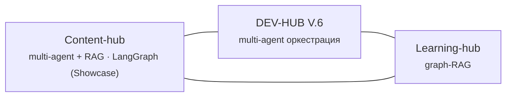

<!-- Language: [🇷🇺 Русский](PROJECTMAP.md) · 🇬🇧 English -->
<!-- Project map. Sections between PORTFOLIO markers are generated by the robot from portfolio.yml — do not edit by hand. -->

# 🗺️ Project map

What's in the portfolio, why each project matters, and how they connect.

## 🌐 Constellation

<!-- PORTFOLIO:CONSTELLATION:START -->

<!-- PORTFOLIO:CONSTELLATION:END -->

> How to read it: **DEV-HUB** is the origin (the multi-agent pipeline that built the others). **Content-hub** and **Learning-hub** share a common Cowork role-switching pattern.

## 📊 Portfolio readiness

<!-- PORTFOLIO:INDEX:START -->
| Project | Status | Coverage |
|---|---|---|
| [DEV-HUB V.6](https://github.com/kristina58ai/dev-hub) | 🟢 done | multi-agent оркестрация |
| Content-hub | 🟢 done | multi-agent + RAG · LangGraph (Showcase) |
| &nbsp;&nbsp;└ [Personal (Cowork)](https://github.com/kristina58ai/content-hub-personal) | 🟢 done | Cowork role-switching + RAG-личность + SQLite + Playwright |
| &nbsp;&nbsp;└ [Showcase (сайт)](https://github.com/kristina58ai/content-hub-showcase) | 🟢 done | LangGraph |
| [Learning-hub](https://github.com/kristina58ai/learning-hub) | 🟢 done | graph-RAG |
<!-- PORTFOLIO:INDEX:END -->

---

## Projects and connections

### DEV-HUB V.6 — the origin
A multi-agent pipeline that takes a project from idea to product. The best practical implementation of agent/network linking (role-switching). **It built the other projects** — hence its central place in the constellation.

### Content-hub — AI for social media (2 versions)
Personal (Cowork) — what I use myself. It uses automatic post-activity checkers (tracking stats and engagement).

Showcase — a website version on LangGraph. Shares a common Cowork pattern with Learning-hub.

### Learning-hub — graph-RAG learning
A knowledge graph + spaced repetition. A deliberate move away from classic RAG. Shares the role-switching approach with Content-hub.

## How the projects complement each other

- **DEV-HUB** provides the method (how to build agent systems) → **Content-hub** and **Learning-hub** are the results of applying it to different problems
- All three show different competencies: orchestration · RAG+i