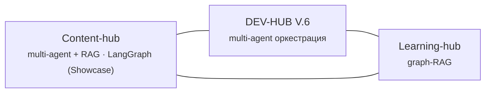

<!-- Язык: 🇷🇺 Русский · [🇬🇧 English](PROJECTMAP.en.md) -->
<!-- Карта проектов. Секции между маркерами PORTFOLIO генерируются роботом из portfolio.yml — вручную не редактировать. -->

# 🗺️ Карта проектов

Что собрано в портфолио, чем каждый проект ценен и как они связаны между собой.

## 🌐 Созвездие

<!-- PORTFOLIO:CONSTELLATION:START -->

<!-- PORTFOLIO:CONSTELLATION:END -->

> Как читать: **DEV-HUB** — исток (мульти-агентный пайплайн, которым построены остальные). **Content-hub** и **Learning-hub** делят общий Cowork-паттерн role-switching.

## 📊 Готовность портфолио

<!-- PORTFOLIO:INDEX:START -->
| Проект | Статус | Компетенция |
|---|---|---|
| [DEV-HUB V.6](https://github.com/kristina58ai/dev-hub) | 🟢 готово | multi-agent оркестрация |
| Content-hub | 🟢 готово | multi-agent + RAG · LangGraph (Showcase) |
| &nbsp;&nbsp;└ [Personal (Cowork)](https://github.com/kristina58ai/content-hub-personal) | 🟢 готово | Cowork role-switching + RAG-личность + SQLite + Playwright |
| &nbsp;&nbsp;└ [Showcase (сайт)](https://github.com/kristina58ai/content-hub-showcase) | 🟢 готово | LangGraph |
| [Learning-hub](https://github.com/kristina58ai/learning-hub) | 🟢 готово | graph-RAG |
<!-- PORTFOLIO:INDEX:END -->

---

## Проекты и связи

### DEV-HUB V.6 — исток системы
Мульти-агентный пайплайн, ведущий проект от идеи до продукта. Лучшая практическая реализация связи агентов и сетей (role-switching). **С его помощью были построены последующие проекты** — отсюда центральное место в созвездии.

### Content-hub — AI для соцсетей (2 версии)
Personal (Cowork) — как использую сам. Здесь используются автоматические чекеры активности на постах (отслеживают статистику и вовлечённость).

Showcase — версия-сайт на LangGraph. Делит с Learning-hub общий Cowork-паттерн.

### Learning-hub — graph-RAG обучение
Граф знаний + интервальные повторения. Осознанный отход от классического RAG. Делит с Content-hub общий подход role-switching.

## Как проекты дополняют друг друга

- **DEV-HUB** даёт метод (как строить агентные системы) → **Content-hub** и **Learning-hub** — это результаты применения метода к разным задачам
- Все три показывают разные компетенции: оркестрация · RAG+интеграции · graph-RAG
- 🔒 Приватные проекты в карту не входят
